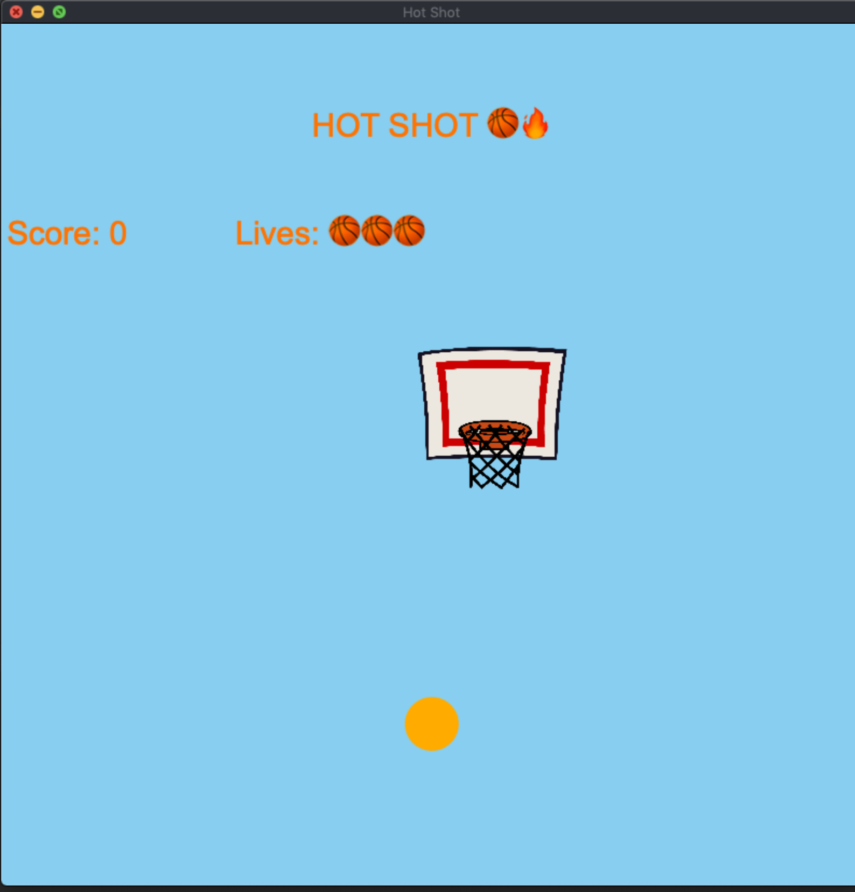

# Hot Shot

This project is a fun game of basketball where the user can aim and shoot by mouse to score as many points as possible.

Below is how the game should look when set up.

### Dependencies
* [CMake](https://cmake.org/)
* [Cinder](https://libcinder.org/docs/index.html)
* [OpenGL](https://libcinder.org/docs/guides/opengl/index.html)

#### Mac OSX
* [CLion](https://www.jetbrains.com/clion/)

### Quick Start
* Clone this repository
* Unzip the folder
* Navigate to `final-project-psavla2/` inside of this folder, find and open `cinder-myapp`
* Build and run the game!

### Controls

This simple game relies solely on a mouse click. Right click in the direction you want to aim the ball and sit back and
hope your shot goes in!

Button | Action
------------ | -------------
Right Mouse-Click | Move ball in direction of mouse-click

### How the game works

You have three lives and your goal is to score as much as possible. However, as your score increases so does the speed
of the backboard moving across the screen. Once you run out of lives the game is over :( .

**Author**: Parth Savla - [`psavla2@illinois.edu`](mailto:psavla2@illinois.edu)
